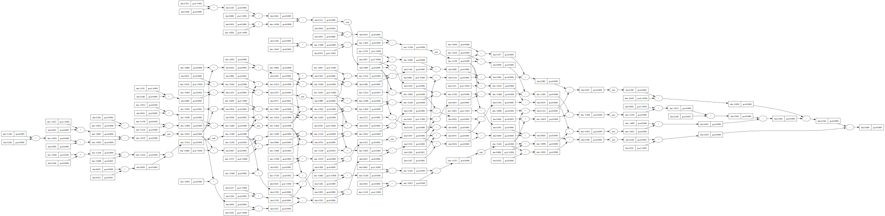
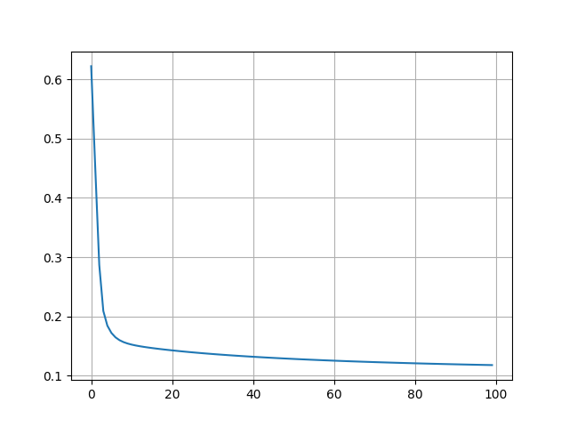

## Neural Network from Scratch

This repository features custom implementations of core machine learning components, creating custom classes for Value, Neuron, Layer, and MultilayerPerceptron. The Value class modifies innate operations such as sum, multiplication, division, power, and tracks operation history, supporting backpropagation for optimization. These components come together to demonstrate a basic optimization algorithm, with operation flows visualized using the Digraph library.

## Usage

- (Optional) Create a virtual environment and install dependencies: `poetry install` or `pip install -r requirements.txt`
- (Optional) Activate the virtual environment: `poetry shell`
- Install dependencies: `pip install -r requirements.txt`
- Run `Jupyter Notebook` to view the notebook
- Run the cells in the notebook to see the results

## Operation Process Visualization

## Loss Graph

## References

[Micrograd](https://youtu.be/VMj-3S1tku0?si=S7RDQWiLs3zEqD3A)
